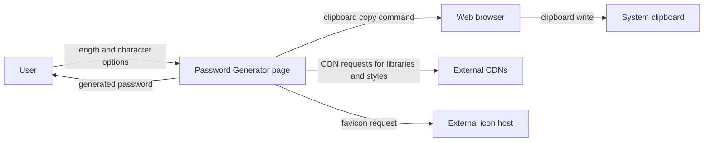
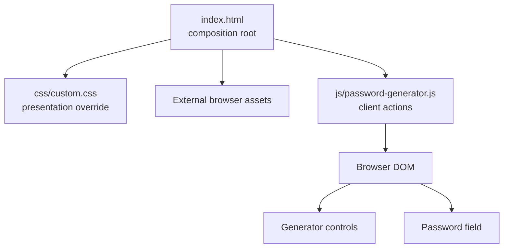
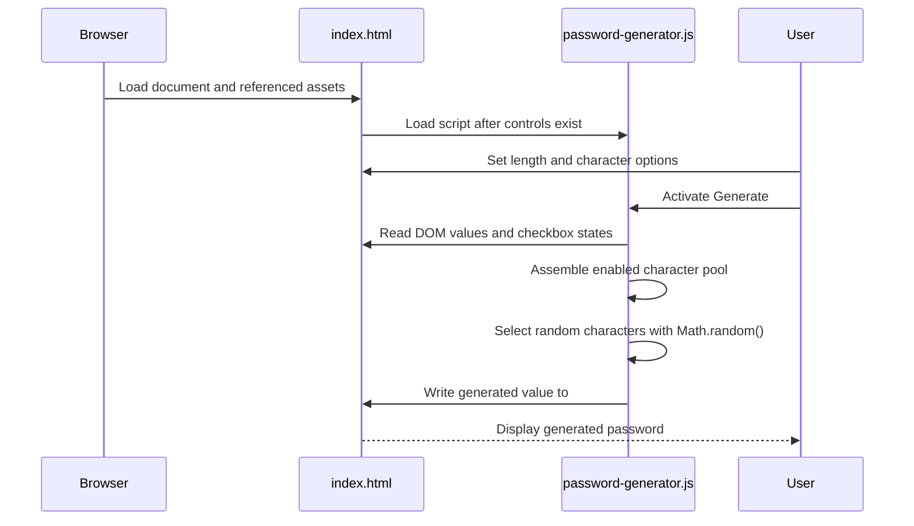
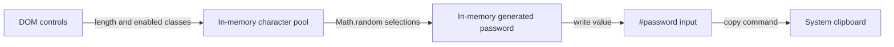
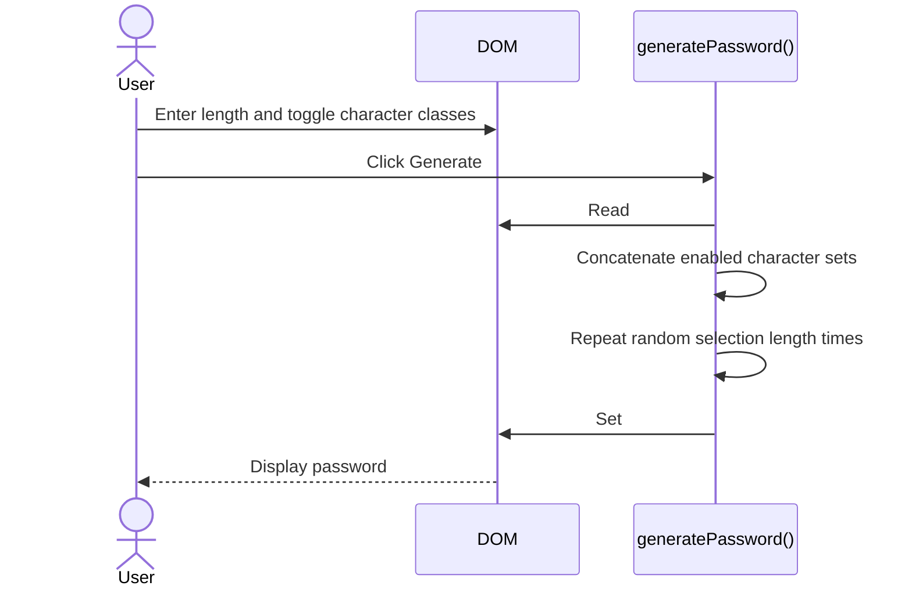
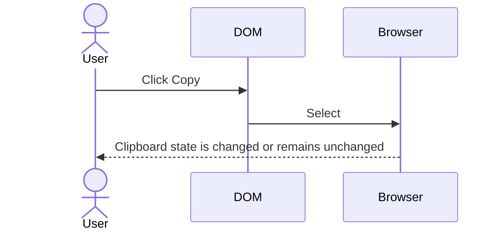
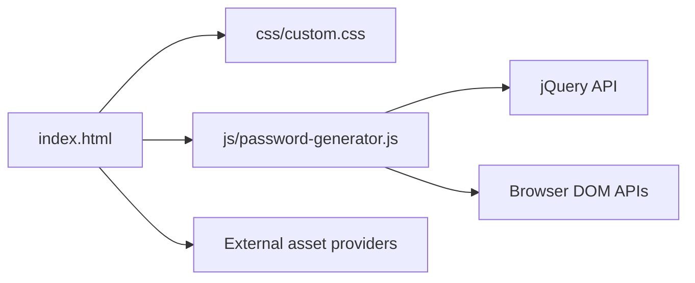

# Password Generator Architecture

This document describes the current architecture of the Password Generator static browser application. It covers the repository's client-side composition, runtime behaviour, data handling, external assets, deployment model, and verification boundaries.

## 📑 Table of Contents

- [Purpose](#-purpose)
- [System Context](#-system-context)
- [Architectural Style](#-architectural-style)
- [Runtime Flow](#-runtime-flow)
- [Components](#-components)
- [Architectural Areas](#-architectural-areas)
  - [Presentation](#presentation)
  - [Client Logic](#client-logic)
  - [Repository Documentation](#repository-documentation)
- [Data Architecture](#-data-architecture)
- [Interfaces and Integrations](#-interfaces-and-integrations)
- [Key Flows](#-key-flows)
  - [Generate A Password](#generate-a-password)
  - [Copy A Password](#copy-a-password)
- [Password Character Selection](#-password-character-selection)
- [Cross-Cutting Concerns](#-cross-cutting-concerns)
  - [Security And Privacy](#security-and-privacy)
  - [Error Handling](#error-handling)
- [Dependency Direction and Rules](#-dependency-direction-and-rules)
- [External Dependencies](#-external-dependencies)
- [Deployment And Operations](#-deployment-and-operations)
- [Compatibility Contracts](#-compatibility-contracts)
- [Testing and Verification](#-testing-and-verification)
- [Design Constraints](#-design-constraints)
- [Source Map](#-source-map)
- [Related Documentation](#-related-documentation)

## 🎯 Purpose

The application generates a password in the browser from character classes selected by the user and exposes a copy action. This document records the current boundaries for contributors maintaining the static page, stylesheet, and JavaScript module. It is intended to make ownership, browser dependencies, data handling, and verification gaps explicit; it does not describe a target redesign.

## 🌐 System Context

The system boundary is the static web page and its in-browser JavaScript execution. A user supplies a requested length and character-class selections, the browser executes the generator, and the resulting password is displayed in a text input. The browser also mediates loading of external assets and the clipboard command. No server, database, application API, or repository-managed persistent store is implemented.



The principal external boundaries are:
- **User and browser:** The user interacts with form controls and action elements; the browser supplies the DOM, JavaScript runtime, selection APIs, and clipboard command.
- **External asset providers:** The page loads jQuery, Bootstrap, Font Awesome, Start Bootstrap styles/scripts, and a favicon from URLs declared in `index.html`; ownership and availability remain external to this repository.
- **System clipboard:** `copyPassword()` requests a copy through the browser's legacy `document.execCommand("copy")` API; the page does not persist clipboard contents.

## 🏗️ Architectural Style

The application uses a static client-side, single-page composition with imperative DOM manipulation. `index.html` is the composition root, `custom.css` supplies local presentation overrides, and `password-generator.js` owns password generation and copy actions. The design has no internal service layer, server process, persistence adapter, or build pipeline. Consequently, changes to the HTML element identifiers or loaded script order can directly affect runtime behaviour.



The principal architecture boundaries are:
- **Page composition:** `index.html` defines controls, identifiers, script order, and external asset references.
- **Presentation:** `css/custom.css` changes local typography and hover styling while relying on Bootstrap and Start Bootstrap classes for the primary layout.
- **Client behaviour:** `js/password-generator.js` reads controls, assembles character pools, generates output, updates the password field, and requests clipboard copying.
- **External assets:** CDN-hosted libraries and styles are runtime dependencies rather than repository-owned modules.

## 🔄 Runtime Flow



The principal runtime sequence is:
1. The browser loads `index.html`, its external assets, `css/custom.css`, and `js/password-generator.js`.
2. The user configures the numeric length and character-class switches in the DOM.
3. `generatePassword()` reads the controls, concatenates enabled character sets, and performs one `Math.random()` selection per requested position.
4. The function writes the result to the `#password` input; no network request or persistent store is involved.
5. A separate copy action selects the input contents and requests the browser copy command.

## 🧩 Components

| Component | Responsibility | Principal Dependencies | Lifetime or Ownership |
|-----------|----------------|------------------------|-----------------------|
| `index.html` | Defines the page structure, controls, element identifiers, inline action handlers, and asset load order. | Browser DOM; CDN assets; local CSS and JavaScript | One document lifetime; repository-owned composition root |
| `css/custom.css` | Provides local presentation overrides for the generator label and GitHub icon hover state. | Bootstrap/Start Bootstrap styles loaded by the page | Applied for the document lifetime; repository-owned stylesheet |
| `js/password-generator.js` | Defines character sets, generates passwords, updates `#password`, and invokes the copy command. | jQuery; browser DOM APIs; `Math.random()` | Script functions live for the document lifetime; repository-owned client logic |
| External browser assets | Provide layout, UI components, easing, icons, and supporting page scripts. | jQuery, Bootstrap, Start Bootstrap, Font Awesome, external favicon host | Browser-managed resource lifetime; externally owned |

## 🗂️ Architectural Areas

### Presentation

Paths:
- [index.html](index.html)
- [css/custom.css](css/custom.css)

Responsibilities:
- Define the generator controls and the password output field.
- Provide stable DOM identifiers consumed by the client logic.
- Load local and external presentation resources.

Boundary rules:
- DOM identifiers used by `password-generator.js` are compatibility-sensitive.
- Presentation changes should not move password generation into markup or duplicate the character-selection logic.

### Client Logic

Paths:
- [js/password-generator.js](js/password-generator.js)

Responsibilities:
- Maintain the repository-defined character sets.
- Read user selections and generate the requested string.
- Update the password field and request clipboard copying.

Boundary rules:
- The module communicates with the page through the existing DOM identifiers and global functions referenced by inline handlers.
- It does not introduce server calls or persistence.

### Repository Documentation

Paths:
- [README.md](README.md)
- [LICENSE](LICENSE)
- [ARCHITECTURE.md](ARCHITECTURE.md)

Responsibilities:
- Describe access to the deployed page and repository governance.
- Record the current architecture and its change-sensitive boundaries.

Boundary rules:
- Documentation must not claim server-side features or automated verification that the repository does not contain.

## 💾 Data Architecture

The application owns only transient user-interface state. Input values originate in DOM controls, are transformed in memory into a character pool and generated string, and are written back to the password input. No password or configuration is transmitted to an application server or persisted by repository code.



| Data or Store | Owner | Representation and Storage | Lifecycle or Consistency |
|---------------|-------|----------------------------|--------------------------|
| Character-set constants | `password-generator.js` | In-memory JavaScript strings | Created when the script loads; immutable by convention during a page session |
| Generator controls | Browser DOM and `index.html` | Numeric input and checkbox values | Mutable through user interaction; exists for the document lifetime |
| Generated password | `generatePassword()` and `#password` | In-memory string and input value | Replaced on each generation; not persisted by repository code |
| Clipboard contents | Browser and operating system | External clipboard state | Updated only when the copy operation succeeds; outside application ownership |

## 🔌 Interfaces and Integrations

| Interface or Integration | Direction | Contract | Owner | Failure Semantics |
|--------------------------|-----------|----------|-------|-------------------|
| DOM controls | Inbound | IDs `length`, `digitsCheckbox`, `lowercaseLettersCheckbox`, `uppercaseLettersCheckbox`, `symbolsCheckbox`, `symbolsExtraCheckbox`, `bracketsCheckbox`, and `othersCheckbox` | `index.html` and `password-generator.js` jointly | Missing or renamed elements can produce invalid reads or runtime errors; no explicit translation exists |
| Password output field | Outbound | `#password` input value | `password-generator.js` | The value is updated in place; no persistence or server response is expected |
| Inline action handlers | Inbound | `generatePassword()` and `copyPassword()` global function names | `password-generator.js` and `index.html` | Renaming without updating markup prevents activation; no fallback is implemented |
| Clipboard API | Outbound | `document.execCommand("copy")` after selecting `#password` | Browser and `copyPassword()` | The return value is not inspected and failures are silent |
| CDN asset loading | Outbound | Script and stylesheet URLs declared in `index.html` | `index.html` and external providers | Asset unavailability can impair layout, icons, jQuery calls, or page scripts; no local fallback exists |

## 🔀 Key Flows

### Generate A Password



The character pool is assembled from each enabled constant in `password-generator.js`. Each output position is selected independently with `Math.random()`. The implementation does not guarantee inclusion of every selected class, uniqueness, cryptographic strength, or a valid result when all character classes are disabled.

### Copy A Password



The copy flow is synchronous and does not display success or failure feedback. It depends on browser support and permissions for the deprecated copy command.

## ⚙️ Password Character Selection

Character selection is controlled by seven independent switches. Digits, lowercase letters, uppercase letters, and the standard symbols set are checked by default in the HTML; extra symbols, brackets, and other characters are unchecked by default. The requested length is taken from the numeric input's value and used as the loop bound. The repository therefore treats the character constants, checkbox IDs, defaults, and output field ID as a single client-side contract.

## 🧵 Cross-Cutting Concerns

### Security And Privacy

Password generation occurs locally in the browser and the repository contains no password submission endpoint or persistence mechanism. The implementation uses `Math.random()`, which is not a cryptographic random source; the generated values must not be represented as suitable for high-assurance secret generation without changing the implementation. The page loads code and styles from external origins, so those providers are within the runtime trust boundary. The copy action transfers the selected value to the system clipboard, which is outside application control.

### Error Handling

There is no explicit validation or error translation layer. An empty or invalid character pool can cause the random-position calculation to produce an unusable result, and invalid length values are delegated to JavaScript loop semantics. Clipboard failure is silent because the return value from `document.execCommand("copy")` is not checked. External asset failures are likewise handled by the browser and may leave the page partially functional.

## 🧭 Dependency Direction and Rules

The dependency direction is page composition to local presentation and client behaviour; client behaviour then depends on the browser DOM and jQuery, while external assets are loaded by the page. There is no reverse dependency from CSS or external assets into the generator's domain logic.



The principal dependency rules are:
- `index.html` owns the DOM contract and must load `password-generator.js` after the generator controls are declared.
- `password-generator.js` may read and update the declared DOM elements, but it must not assume a server or persistent store exists.
- `custom.css` may override presentation without becoming a source of behavioural state.
- External assets remain replaceable runtime providers, but the current page has no local fallback for their absence.

## 📦 External Dependencies

| Dependency | Responsibility | Integration Boundary | Architectural Consequence |
|------------|----------------|----------------------|---------------------------|
| jQuery 3.7.0 slim | DOM selection, value access, and checkbox state queries | `index.html` script tag and `password-generator.js` | Generator logic depends on the jQuery global being loaded successfully |
| Bootstrap 5.3.0 | Grid, form, button, navigation, and responsive styles/scripts | `index.html` CDN links | Visual layout and some browser-side components depend on CDN availability |
| Start Bootstrap Freelancer assets | Additional page styles and scripts | `index.html` external links | The page inherits an external visual baseline and script dependency |
| Font Awesome 6.4.0 | Icons used in navigation and controls | `index.html` external script | Icon presentation depends on external script loading |
| External favicon host | Browser tab icon | `index.html` favicon URL | Favicon availability does not affect generator logic |

## 🚀 Deployment And Operations

The deployment unit is the repository's static file set, served by any web server or static hosting provider. The README identifies a GitHub Pages URL as the public page. There is no application process, database, background worker, scheduled job, server configuration, or migration mechanism in the repository.

| Concern | Current Design | Architectural Consequence |
|---------|----------------|---------------------------|
| Process topology | One browser document with client-side JavaScript | Availability depends on static hosting and browser execution |
| Persistent state | None in repository code | Reloading the page loses generator inputs and output unless the browser retains form state independently |
| Network requirements | External CDN and favicon requests at page load | Offline use or provider failure can degrade functionality |
| Scaling | Static files served independently of user count | Scaling is delegated to the hosting provider; no server capacity model exists |
| Operator-visible output | Rendered page and browser clipboard interaction | Diagnosis is primarily through browser developer tools; no application logs or health endpoint exist |

## 🛡️ Compatibility Contracts

| Contract | Owner | Invariant | Verification | Change Policy |
|----------|-------|-----------|--------------|---------------|
| DOM element identifiers | `index.html` and `password-generator.js` | Generator control and output IDs remain aligned | Manual browser smoke check | Update both markup and script together when identifiers change |
| Global action functions | `index.html` and `password-generator.js` | `generatePassword()` and `copyPassword()` remain callable by inline handlers | Manual browser smoke check | Preserve names or replace inline handlers in the same change |
| Character-class defaults | `index.html` | Four base classes are checked and three optional classes are unchecked on initial load | Inspect rendered page or source | Treat changes as user-facing behaviour changes |
| Static hosting paths | Repository layout and hosting configuration | `index.html`, `css/custom.css`, and `js/password-generator.js` remain at their referenced relative paths | Load the deployed page | Preserve paths or update all references |

## ✅ Testing and Verification

The repository contains no automated test project, package manifest, or test script. Verification is therefore manual and should cover page load, generation with each character-class combination, invalid or zero-length input, all options disabled, and copy behaviour in a supported browser. External asset availability should also be checked because the page has no local fallback.

Execute the principal automated verification with:

```bash
# No automated verification command is defined in this repository.
```

## ⚠️ Design Constraints

- **Client-only execution:** All generation and copy orchestration occurs in the browser, so there is no server-side policy enforcement or recovery path.
- **Non-cryptographic randomness:** `Math.random()` does not provide a cryptographic randomness guarantee.
- **Implicit validation:** Input and character-pool validation are absent; edge-case behaviour follows browser and JavaScript semantics.
- **External runtime assets:** Core presentation and jQuery-dependent behaviour rely on third-party URLs declared in the page.
- **Legacy clipboard mechanism:** Copying uses `document.execCommand("copy")`, whose support and permission behaviour depend on the browser.
- **Global DOM coupling:** Inline handlers and fixed element IDs couple markup changes directly to client logic.

## 🗺️ Source Map

| Area | Path |
|------|------|
| Page composition | [index.html](index.html) |
| Local presentation | [css/custom.css](css/custom.css) |
| Client generation and copy logic | [js/password-generator.js](js/password-generator.js) |
| Project usage and deployment link | [README.md](README.md) |
| Repository licence | [LICENSE](LICENSE) |
| Funding metadata | [.github/FUNDING.yml](.github/FUNDING.yml) |

## 📚 Related Documentation

- [README.md](README.md) describes the public GitHub Pages URL and donation link; this document records architectural boundaries and runtime ownership.
- [LICENSE](LICENSE) defines the repository's licensing terms, which are separate from implementation architecture.
